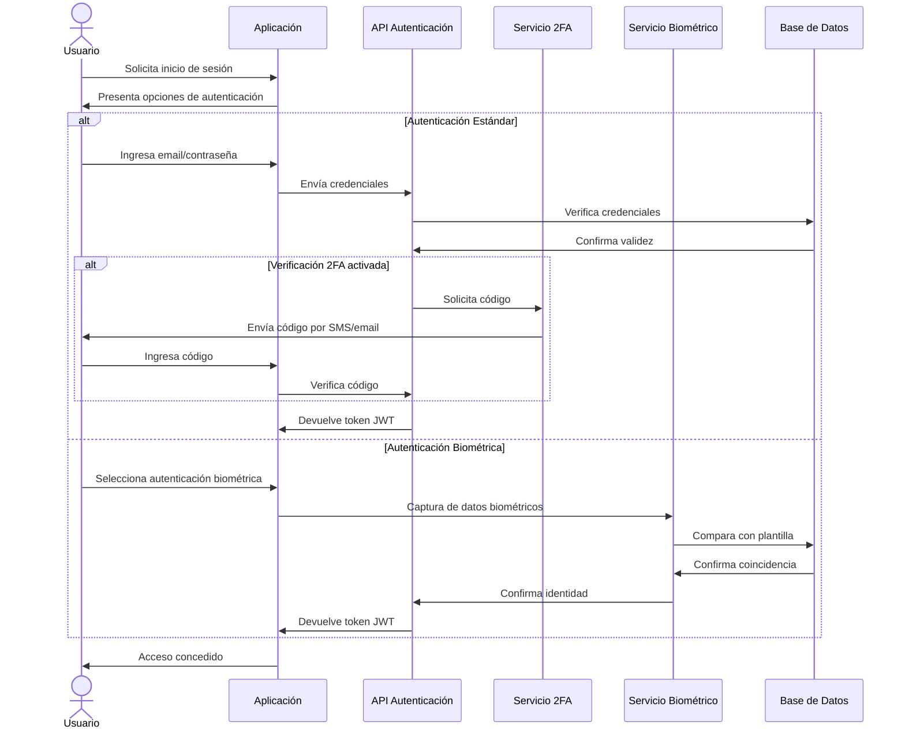
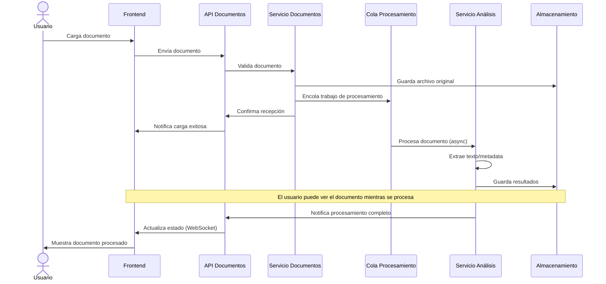
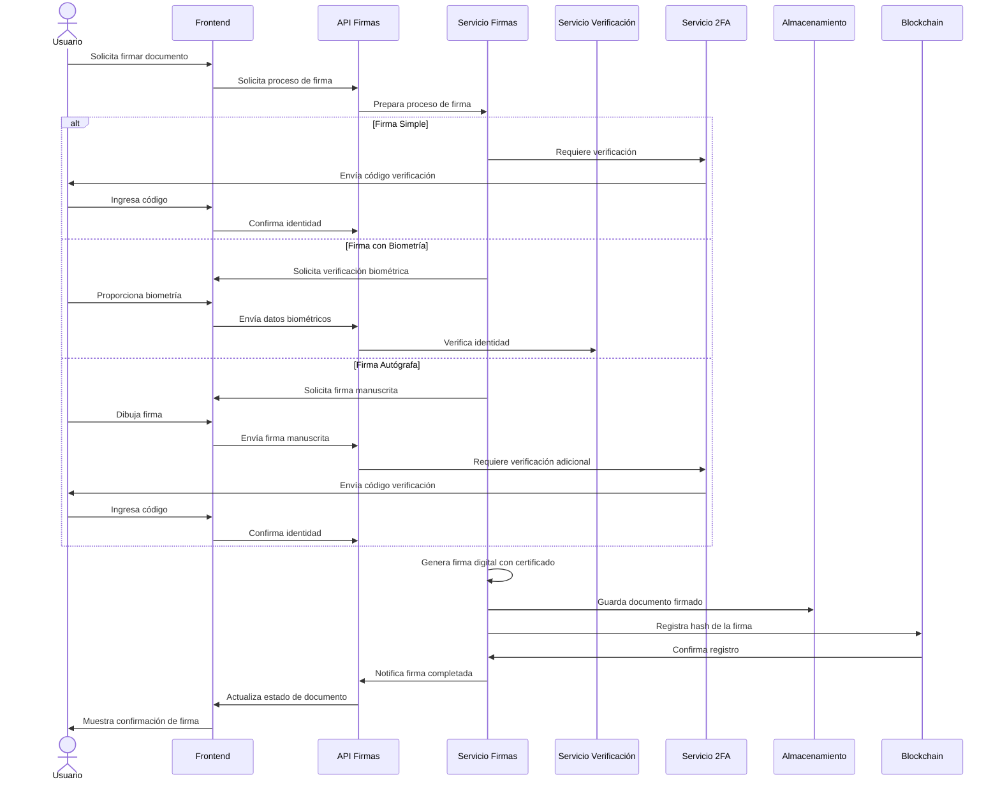
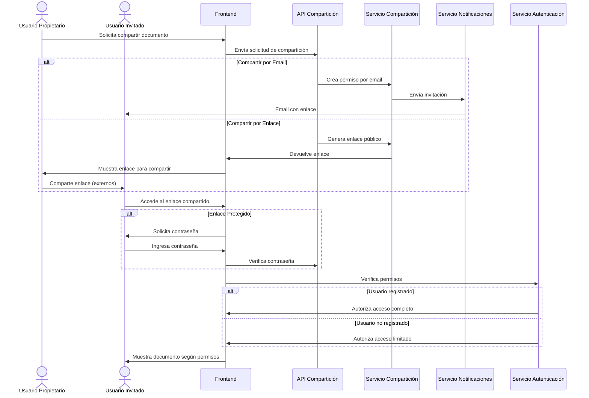
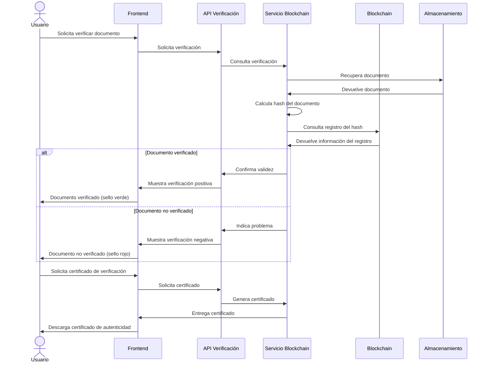
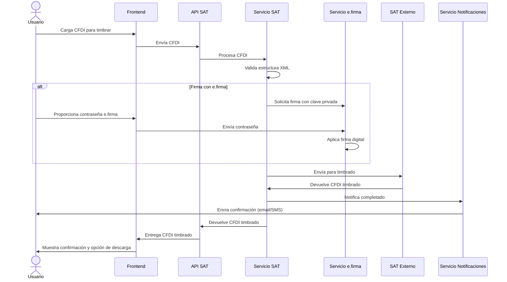

# Documento de Arquitectura: DocuSense - Plataforma de Firma Electrónica (CMMI DEV Nivel 5)

## 1. Visión General de la Arquitectura

DocuSense es una plataforma integral de firma electrónica diseñada específicamente para el mercado mexicano, cumpliendo con requisitos legales como el Código de Comercio (Art. 89) y la Ley de Firma Electrónica Avanzada (LFEA). La plataforma proporciona soluciones para firmas digitales, gestión documental, autenticación biométrica, integración con SAT, y verificación mediante tecnología blockchain.

### 1.1 Diagrama de Arquitectura General

```
┌─────────────────────────────────────────────────────────────────────────┐
│                        Interfaz de Usuario                               │
├───────────────┬───────────────┬────────────────┬────────────────────────┤
│ Frontend Web  │ Frontend      │ Aplicación PWA │ SDK Integración        │
│ (React.js)    │ Móvil         │ (ServiceWorker)│ (PHP/.NET/REST)        │
│               │ (React Native)│                │                        │
└───────┬───────┴───────┬───────┴────────┬───────┴─────────┬──────────────┘
        │               │                │                 │
        ▼               ▼                ▼                 ▼
┌──────────────────────────────────────────────────────────────────────────┐
│                          API Gateway / Load Balancer                      │
└────────────────────────────────────┬─────────────────────────────────────┘
                                    │
                                    ▼
┌──────────────────────────────────────────────────────────────────────────┐
│                    Microservicios Backend (NestJS)                        │
├────────────────┬────────────────┬────────────────┬────────────────┬──────┤
│ Autenticación  │ Gestión        │ Firma          │ Compartición   │      │
│ y Usuarios     │ Documental     │ Electrónica    │ y Permisos     │      │
├────────────────┼────────────────┼────────────────┼────────────────┤      │
│ Análisis       │ Notificaciones │ Integración    │ Blockchain     │  ... │
│ de Documentos  │ y Webhooks     │ SAT/CFDI       │ y Verificación │      │
└────────┬───────┴───────┬────────┴───────┬────────┴───────┬────────┴──────┘
         │               │                │                │
         ▼               ▼                ▼                ▼
┌─────────────────────────────────────────────────────────────────────────┐
│                       Servicios de Infraestructura                       │
├─────────────┬─────────────┬─────────────┬─────────────┬─────────────────┤
│ PostgreSQL  │ Redis Cache │ RabbitMQ    │ Amazon S3   │ Hyperledger     │
│ (Datos)     │ (Sesiones)  │ (Colas)     │ (Archivos)  │ (Blockchain)    │
└─────────────┴─────────────┴─────────────┴─────────────┴─────────────────┘
```

### 1.2 Componentes Principales

#### 1.2.1 Frontend
- **Web (React.js + TypeScript)**: Interfaz principal para navegadores de escritorio
- **Móvil (React Native)**: Aplicaciones nativas para iOS y Android
- **PWA**: Funcionalidad offline para uso móvil
- **SDK de Integración**: Bibliotecas para integrar con sistemas externos

#### 1.2.2 Backend (NestJS)
- **Microservicios modulares** para separación de responsabilidades
- **API RESTful** para comunicación entre servicios
- **Autenticación multifactor** (JWT + biometría + 2FA)

#### 1.2.3 Almacenamiento y Procesamiento
- **PostgreSQL**: Base de datos principal
- **Amazon S3**: Almacenamiento de documentos
- **Redis**: Caché y gestión de sesiones
- **RabbitMQ**: Sistema de colas para procesamiento asíncrono
- **Hyperledger Fabric**: Blockchain para inmutabilidad y verificación

## 2. Flujos de la Aplicación

### 2.1 Flujo de Autenticación y Acceso



### 2.2 Flujo de Carga y Procesamiento de Documentos



### 2.3 Flujo de Firma Electrónica



### 2.4 Flujo de Compartición de Documentos



### 2.5 Flujo de Análisis y Verificación Blockchain



### 2.6 Flujo de Integración con SAT



## 3. Vista de Componentes

### 3.1 Componentes del Frontend

#### 3.1.1 Módulos Principales
- **AuthModule**: Gestión de autenticación, registro y sesiones
- **DocumentModule**: Visualización y gestión de documentos
- **SignatureModule**: Componentes de firma electrónica
- **AnalyticsModule**: Paneles de análisis y estadísticas
- **AdminModule**: Gestión administrativa y configuración

#### 3.1.2 Servicios del Frontend
- **AuthService**: Manejo de tokens, sesiones y permisos
- **DocumentService**: Operaciones CRUD de documentos
- **SignatureService**: Generación y validación de firmas
- **ApiService**: Cliente HTTP para comunicación con backend
- **NotificationsService**: Manejo de notificaciones en tiempo real

### 3.2 Componentes del Backend

#### 3.2.1 Microservicios
- **AuthService**: Autenticación y gestión de usuarios
- **DocumentService**: Gestión documental y metadatos
- **SignatureService**: Procesamiento de firmas electrónicas
- **StorageService**: Almacenamiento y recuperación de archivos
- **AnalyticsService**: Análisis de documentos y extracción de contenido
- **BlockchainService**: Interacción con Hyperledger
- **NotificationService**: Gestión de notificaciones (email, SMS, push)
- **IntegrationService**: Integraciones con sistemas externos (SAT, etc.)

#### 3.2.2 Capas de Servicio
- **Controllers**: Endpoints REST para comunicación con clientes
- **Services**: Lógica de negocio
- **Repositories**: Acceso a datos
- **DTOs**: Transferencia de datos entre capas
- **Entities**: Modelos de datos
- **Middleware**: Interceptores para autenticación, logging, etc.

## 4. Vista de Datos

### 4.1 Modelo de Datos Principal

```
┌─────────────────┐      ┌─────────────────┐      ┌─────────────────┐
│     Users       │      │    Documents    │      │   Signatures    │
├─────────────────┤      ├─────────────────┤      ├─────────────────┤
│ id              │      │ id              │      │ id              │
│ name            │      │ title           │      │ documentId      │
│ email           │      │ description     │      │ userId          │
│ password        │      │ filename        │      │ createdAt       │
│ isAdmin         │◄─────┤ ownerId         │◄─────┤ position        │
│ twoFactorEnabled│      │ status          │      │ signatureType   │
│ biometricEnabled│      │ mimeType        │      │ signatureData   │
│ createdAt       │      │ fileSize        │      │ valid           │
└─────────────────┘      │ filePath        │      │ reason          │
                         │ metadata         │      └─────────────────┘
┌─────────────────┐      │ extractedContent│      ┌─────────────────┐
│  BiometricData  │      │ isEncrypted     │      │    Comments     │
├─────────────────┤      │ createdAt       │      ├─────────────────┤
│ id              │      │ updatedAt       │      │ id              │
│ userId          │      └─────────────────┘      │ documentId      │
│ type            │                                │ userId          │
│ descriptorData  │      ┌─────────────────┐      │ content         │
│ createdAt       │      │    Sharing      │      │ parentId        │
└─────────────────┘      ├─────────────────┤      │ isResolved      │
                         │ id              │      │ resolvedBy      │
┌─────────────────┐      │ documentId      │      │ position        │
│ BlockchainData  │      │ userId          │      │ createdAt       │
├─────────────────┤      │ permissionLevel │      │ updatedAt       │
│ id              │      │ expiresAt       │      └─────────────────┘
│ documentId      │      │ createdAt       │
│ transactionId   │      └─────────────────┘
│ blockHeight     │
│ timestamp       │      ┌─────────────────┐
│ documentHash    │      │   ShareLinks    │
│ createdAt       │      ├─────────────────┤
└─────────────────┘      │ id              │
                         │ documentId      │
                         │ token           │
                         │ permissionLevel │
                         │ expiresAt       │
                         │ requiresPassword│
                         │ password        │
                         │ maxUses         │
                         │ accessCount     │
                         │ isActive        │
                         │ createdAt       │
                         └─────────────────┘
```

### 4.2 Modelo de Persistencia

- **Base de Datos Relacional (PostgreSQL)**: Almacenamiento principal para datos estructurados
- **Almacenamiento Blob (Amazon S3)**: Documentos, archivos y contenido binario
- **Caché (Redis)**: Sesiones, tokens temporales y datos frecuentemente accedidos
- **Blockchain (Hyperledger)**: Registro inmutable para verificación de integridad

## 5. Vista de Despliegue

### 5.1 Arquitectura de Despliegue

```
┌───────────────────────────────────────────────────────────────────────┐
│                          CloudFront CDN                                │
└───────────────────────────────────────────┬───────────────────────────┘
                                            │
                                            ▼
┌───────────────────────────────────────────────────────────────────────┐
│                        AWS Application Load Balancer                   │
└───────────────┬─────────────────────────────┬───────────────┬─────────┘
                │                             │               │
                ▼                             ▼               ▼
┌────────────────────────┐   ┌────────────────────────┐   ┌───────────────┐
│   Frontend Containers  │   │   Backend Containers   │   │  Monitoring   │
│   (ECS/Fargate)        │   │   (ECS/Fargate)        │   │  (Prometheus) │
└────────────────────────┘   └───────────┬────────────┘   └───────────────┘
                                         │
                  ┌─────────────────────┬┴┬─────────────────────┐
                  │                     │ │                     │
                  ▼                     ▼ ▼                     ▼
┌─────────────────────┐  ┌──────────────────────┐  ┌──────────────────────┐
│ RDS (PostgreSQL)    │  │ ElastiCache (Redis)  │  │ Amazon S3            │
└─────────────────────┘  └──────────────────────┘  └──────────────────────┘
                  ▲                     ▲ ▲                     ▲
                  │                     │ │                     │
                  └─────────────────────┼─┼─────────────────────┘
                                        │ │
                                        ▼ ▼
                           ┌──────────────────────────────┐
                           │ Hyperledger Fabric Cluster   │
                           │ (Amazon Managed Blockchain)  │
                           └──────────────────────────────┘
```

### 5.2 Entornos de Despliegue

#### 5.2.1 Entorno de Desarrollo
- Contenedores Docker locales
- Base de datos PostgreSQL en contenedor
- Mocks para servicios externos

#### 5.2.2 Entorno de Pruebas/QA
- Clúster de Kubernetes en AWS
- Bases de datos replicadas pero con datos de prueba
- Integración con servicios externos en sandbox

#### 5.2.3 Entorno de Producción
- AWS ECS/Fargate para contenerización
- Alta disponibilidad y escalado automático
- Bases de datos con réplicas y backups automáticos
- Servicios externos en modo producción

## 6. Tecnologías y Componentes

### 6.1 Frontend
| Tecnología | Propósito |
|------------|-----------|
| React.js | Biblioteca UI principal |
| TypeScript | Tipado estático para desarrollo robusto |
| React Native | Desarrollo móvil multiplataforma |
| Redux | Gestión de estado |
| Tailwind CSS | Estilos y componentes visuales |
| Socket.io | Comunicación en tiempo real |
| PDF.js | Visualización de documentos PDF |
| face-api.js | Reconocimiento facial para biometría |

### 6.2 Backend
| Tecnología | Propósito |
|------------|-----------|
| NestJS | Framework backend principal |
| TypeORM | ORM para acceso a bases de datos |
| Passport.js | Estrategias de autenticación |
| JWT | Tokens de autenticación |
| bcrypt | Hashing de contraseñas |
| pdf-lib | Manipulación de PDFs |
| Hyperledger SDK | Integración con blockchain |
| RabbitMQ | Sistema de colas para procesamiento |

### 6.3 Infraestructura
| Tecnología | Propósito |
|------------|-----------|
| Docker | Contenedores para servicios |
| Kubernetes | Orquestación de contenedores |
| AWS | Infraestructura cloud |
| PostgreSQL | Base de datos principal |
| Redis | Caché y gestión de sesiones |
| S3 | Almacenamiento de documentos |
| CloudFront | CDN para distribución de contenido |
| Prometheus/Grafana | Monitorización |

## 7. Consideraciones de Seguridad

### 7.1 Autenticación y Autorización
- Sistema de autenticación multifactor (MFA)
- Autenticación biométrica con verificación de vida
- Gestión de sesiones con expiración automática
- RBAC (Role-Based Access Control) para permisos granulares

### 7.2 Seguridad de Datos
- Cifrado en reposo para documentos sensibles (AES-256)
- Cifrado en tránsito (TLS 1.3)
- Sanitización de datos de entrada
- Gestión segura de claves criptográficas

### 7.3 Protección de API
- Limitación de tasa (rate limiting)
- Validación estricta de entradas
- Protección contra ataques CSRF/XSS
- Encabezados de seguridad HTTP

### 7.4 Conformidad Legal
- Cumplimiento con LFPDPPP (México)
- Cumplimiento con reglamentos del SAT para e.firma
- Registro detallado para auditoría
- Separación de datos para soberanía de datos

## 8. Métricas y Monitorización (CMMI Level 5)

### 8.1 Métricas de Rendimiento
- Tiempo de respuesta API (<200ms p95)
- Tiempo de procesamiento de documentos (<5s para documentos estándar)
- Tasa de éxito de firmas (>99.9%)
- Disponibilidad del sistema (>99.95%)

### 8.2 Métricas de Calidad
- Tasa de defectos (<1 por 1000 LOC)
- Cobertura de pruebas (>90%)
- Tiempo medio de resolución de defectos (<48h)
- Satisfacción del usuario (>4.5/5)

### 8.3 Instrumentación
- Trazas distribuidas con OpenTelemetry
- Logging centralizado con ELK Stack
- Alertas automatizadas para anomalías
- Dashboards de monitorización en tiempo real

## 9. Procesos de CMMI Nivel 5

### 9.1 Gestión Cuantitativa del Proyecto
- Recopilación automatizada de métricas de proceso
- Análisis estadístico de desempeño del proyecto
- Predicción de tendencias y desviaciones
- Optimización basada en análisis de datos

### 9.2 Gestión del Rendimiento Organizacional
- Repositorio central de métricas y KPIs
- Análisis comparativo entre proyectos
- Identificación y propagación de mejores prácticas
- Mejora continua basada en datos

### 9.3 Análisis Causal y Resolución
- Proceso formal de análisis de causa raíz
- Prevención proactiva de defectos
- Retroalimentación automatizada a equipos de desarrollo
- Mejora continua de procesos de desarrollo

## 10. Escalabilidad y Evolución

### 10.1 Estrategia de Escalabilidad
- Arquitectura de microservicios para escalado independiente
- Escalado horizontal automático basado en métricas de carga
- Particionamiento de datos para rendimiento óptimo
- Cachés distribuidas para reducir carga en bases de datos

### 10.2 Planificación de Evolución
- API versionada para compatibilidad retroactiva
- Estrategia de migración de datos para actualizaciones
- Proceso de integración continua/despliegue continuo (CI/CD)
- Pruebas A/B para nuevas características

## 11. Plan de Recuperación ante Desastres

### 11.1 Estrategia de Backup
- Backups incrementales automáticos (cada hora)
- Backups completos diarios
- Retención de backups: 7 días (incrementales), 90 días (completos)
- Validación automática de backups

### 11.2 Plan de Continuidad
- Replicación asíncrona multi-región
- RPO (Recovery Point Objective): <15 minutos
- RTO (Recovery Time Objective): <30 minutos
- Simulacros de recuperación trimestrales

## 12. Glosario de Términos

| Término | Definición |
|---------|------------|
| LFEA | Ley de Firma Electrónica Avanzada |
| e.firma | Certificado digital emitido por el SAT |
| CFDI | Comprobante Fiscal Digital por Internet |
| PAC | Proveedor Autorizado de Certificación |
| FIEL | Firma Electrónica Avanzada (nombre anterior de e.firma) |
| JWT | JSON Web Token (estándar para tokens de autenticación) |
| 2FA | Autenticación de dos factores |
| MFA | Autenticación multifactor |
| API | Application Programming Interface |
| SDK | Software Development Kit |
