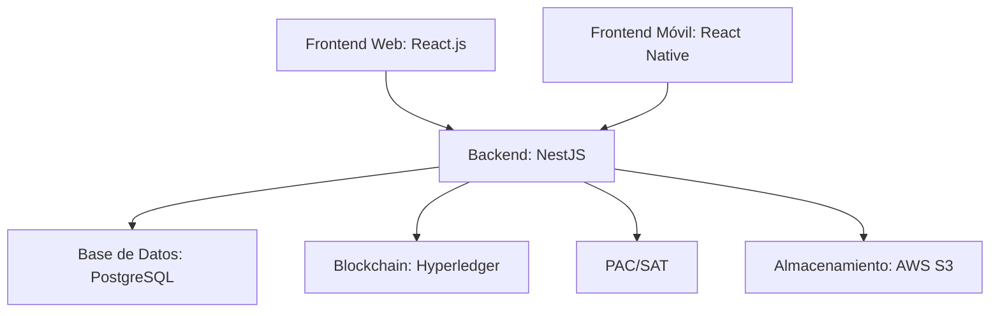

### **DOCUSENSE - Plan Técnico: Plataforma de Firma Electrónica (Web + Móvil)**

**Enfoque:** Solución integral para México con validez legal, biometría y diferenciadores competitivos.

---

## **1. Arquitectura General**



---

## **2. Stack Tecnológico**

### **Frontend (Web + Móvil)**

| **Componente** | **Tecnología**                                | **Justificación**                                 |
| -------------- | --------------------------------------------- | ------------------------------------------------- |
| **Web**        | React.js + TypeScript                         | Reutilización de lógica con móvil (React Native). |
| **Móvil**      | React Native                                  | Desarrollo cross-platform (iOS/Android).          |
| **Navegación** | React Router (Web) / React Navigation (Móvil) | Flujos consistentes.                              |
| **UI/UX**      | Tailwind CSS (Web) + NativeWind (Móvil)       | Diseño unificado.                                 |
| **PDF/Firmas** | PDF.js (Web) / react-native-pdf (Móvil)       | Visualización multiplataforma.                    |

### **Backend**

| **Componente**      | **Tecnología**     | **Función**                                |
| ------------------- | ------------------ | ------------------------------------------ |
| **API Core**        | NestJS (Node.js)   | Escalabilidad y estructura modular.        |
| **Autenticación**   | JWT + OAuth 2.0    | Soporte para biometría y 2FA.              |
| **Integración SAT** | xml-crypto + SOAP  | Firma de CFDI y validación de e.firma.     |
| **Blockchain**      | Hyperledger Fabric | Sellado de tiempo inmutable.               |
| **Colas**           | RabbitMQ           | Procesamiento asíncrono de firmas masivas. |

### **Infraestructura**

| **Componente**     | **Tecnología**          | **Requisito**              |
| ------------------ | ----------------------- | -------------------------- |
| **Hosting**        | AWS México (us-east-1)  | Soberanía de datos.        |
| **CI/CD**          | GitHub Actions + Docker | Despliegues automatizados. |
| **Monitorización** | Prometheus + Grafana    | Alertas de rendimiento.    |

---

## **3. Flujos Clave**

### **A. Firma de Documentos**

1. **Web**:
   - Usuario sube PDF/XML → Autenticación (correo/SMS/biometría) → Firma con PAC → Sellado en blockchain.
2. **Móvil**:
   - Captura de firma manuscrita o selfie → Validación con liveness detection → Sincronización con backend.

### **B. Integración con SAT**

```plaintext
1. Usuario carga CFDI → Backend valida estructura XML → Firma con clave privada → Timbre con PAC → Envío al SAT.
2. Respuesta del SAT → Notificación vía WhatsApp/email.
```

### **C. Offline Mode**

- **Móvil**: SQLite almacena documentos pendientes → Sincronización al recuperar conexión.
- **Web**: Service Workers (PWA) para persistencia temporal.

---

## **4. Diferenciadores Técnicos**

| **Característica**            | **Implementación**                               | **Ventaja Competitiva**                          |
| ----------------------------- | ------------------------------------------------ | ------------------------------------------------ |
| **Biometría multifactor**     | Face ID (iOS) + Huella (Android) + e.firma (SAT) | Cumple con LFEA y es más accesible que DocuSign. |
| **Blockchain para auditoría** | Hyperledger registra hash + metadatos            | Validez legal ante disputas.                     |
| **Plantillas prelegales**     | Contratos MX (arrendamiento, NDA) en JSON/XML    | Ahorra tiempo a abogados/contadores.             |
| **API para sistemas locales** | SDK en PHP/.NET (Aspel, Contpaq)                 | Facilita adopción en PYMES.                      |

---

## **5. Requisitos Legales (México)**

- **Almacenamiento**: Cifrado AES-256 + servidores en México (AWS/GCP).
- **Certificaciones**:
  - **PAC autorizado** (IdenTrust, Advanced).
  - **ISO 27001** para gestión de seguridad.
- **Privacidad**: Consentimiento explícito para datos biométricos (LFPDPPP).

---

## **6. Roadmap de Desarrollo**

| **Fase**   | **Duración** | **Entregables**                                  |
| ---------- | ------------ | ------------------------------------------------ |
| **MVP**    | 3 meses      | Web app + Firma simple + Integración PAC básica. |
| **Fase 1** | 6 meses      | App móvil + Biometría + Blockchain.              |
| **Fase 2** | 12 meses     | AI para detección de fraude + White-label.       |

---

## **7. Comparativa con Competidores**

| **Funcionalidad**      | **FirmaMX**          | **DocuSign**               | **HelloSign** |
| ---------------------- | -------------------- | -------------------------- | ------------- |
| **Biometría en móvil** | ✅ (Selfie + huella) | ❌ (Solo firma manuscrita) | ❌            |
| **Integración SAT**    | ✅ (CFDI + e.firma)  | ❌                         | ❌            |
| **Precio (PYMES)**     | $299 MXN/mes         | $1,200 MXN/mes             | $800 MXN/mes  |

---

## **8. Presupuesto Estimado**

| **Rubro**             | **Costo (MXN)**  |
| --------------------- | ---------------- |
| Desarrollo (12 meses) | $1,200,000       |
| Infraestructura (AWS) | $180,000/año     |
| Certificaciones (PAC) | $250,000 (único) |

---

### **9. Anexos**

- **Diagramas técnicos** (arquitectura, flujos de firma).
- **Checklist legal** (LFEA, LFPDPPP).

---
